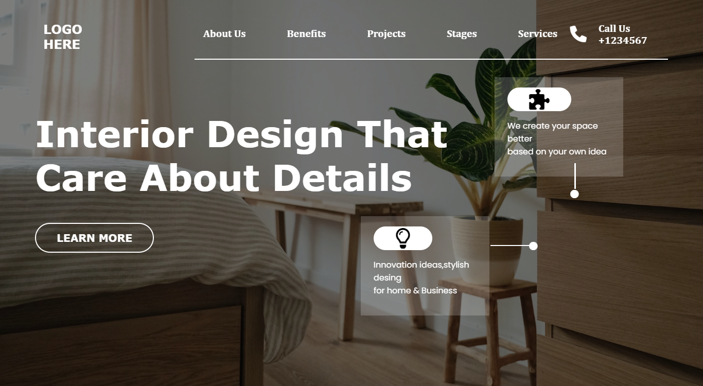

# Project 10

## Interior Design Landing Page

### 🏘️ A Landing Page of a Interior Design Agency. 😀

  

#### Built Using HTML & CSS (Desktop view Only 💻)

#### Time Taken to finish the Project - 3 hours ⌛ (approx)

---

## Things learned from project -

- 
- 
- 
- 

---

## Live Demo [Demo](https://manas-ranjan-murmu-project10.netlify.app/)

### Screenshot

---
